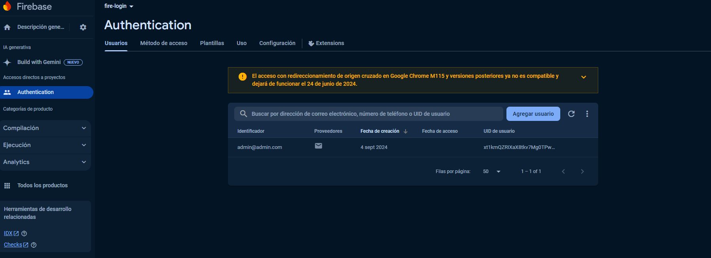
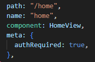
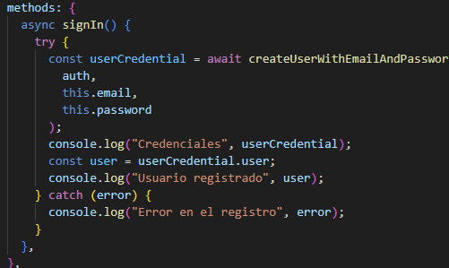
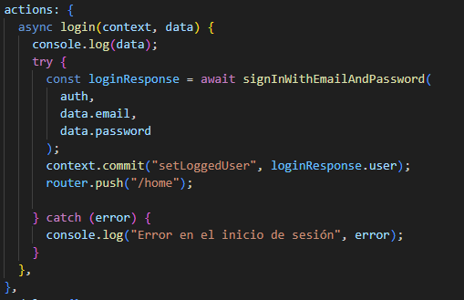
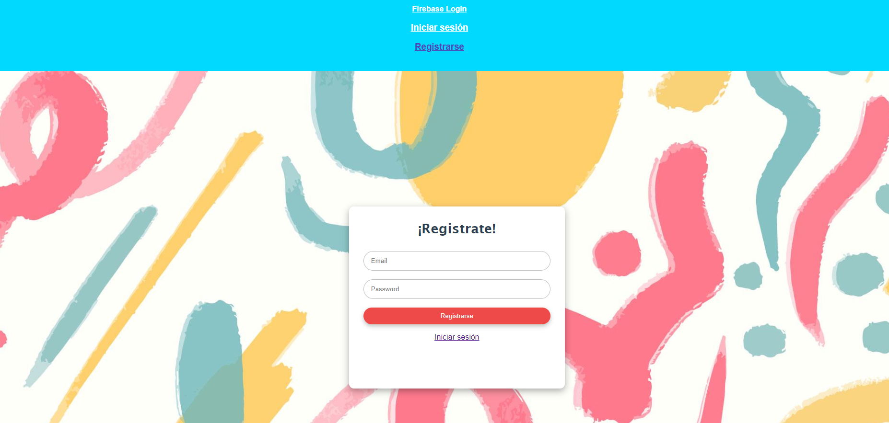

- [Desafío Firebase Login](#desafío-firebase-login)
  - [Requerimientos](#requerimientos)
  - [Pasos](#pasos)
  - [Resultado](#resultado)

# Desafío Firebase Login

- Descripción

Un cliente nos solicita un demo de una aplicación web que contenga autenticación. En este
demo nos pide que existan 3 vistas, Sign up, Login y Home. La vista de Home es necesario
que esté restringida, es decir, el usuario al ingresar a la aplicación, automáticamente será
redirigido a la vista Sign up en caso de que no esté registrado.

● La vista Sign Up deberá ser pública y solo visible para los usuarios que no estén
logeados, siendo su función ofrecer un formulario de registro de usuarios.

● La vista Login deberá ser pública y solo visible para los usuarios que no estén
logeados, su función será permitir el inicio de sesión de usuarios.

● La vista Home deberá ser una vista privada solo accesible por usuarios autenticados.

Deberás usar los guardianes de Vue Router para condicionar y restringir el acceso a los
usuarios a la vista Home. 

  ---

## Requerimientos

1. Usar Firebase Authentication para integrar un sistema de usuarios.

2. Usar guardianes de Vue Router para restringir el acceso a la vista Home.

3. Crear un componente que permita crear nuevos usuarios.

4. Crear un componente que permita iniciar sesión.

5. Generar el Build producción para desplegar la aplicación con Firebase Hosting.

   ---

## Pasos

1. Usamos Firebase Authentication para integrar un sistema de usuarios

1. Usamos guardianes de Vue Router para restringir el acceso a la vista Home.

1. Creamos un componente que permita crear nuevos usuarios.

1. Creamos un componente que permita iniciar sesión.

5. Generamos el Build producción para desplegar la aplicación con Firebase Hosting

---

## Resultado

